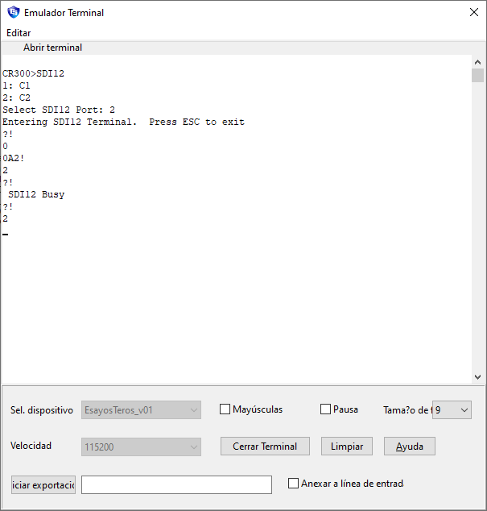
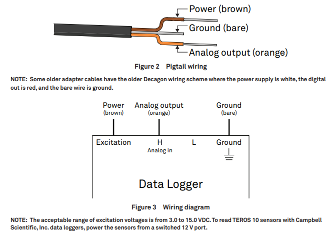
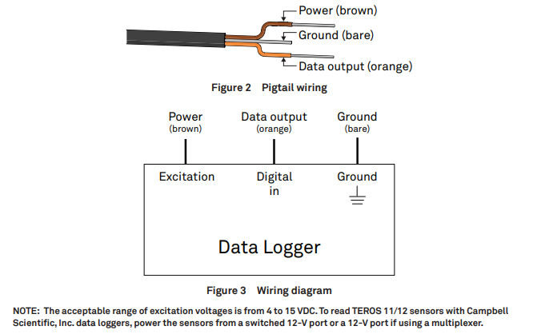
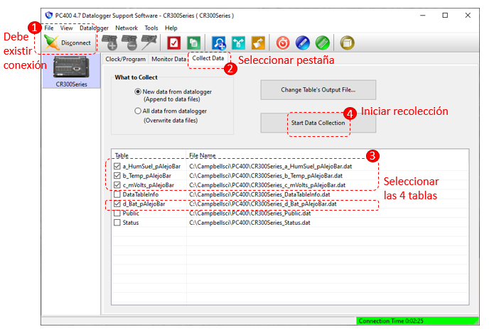
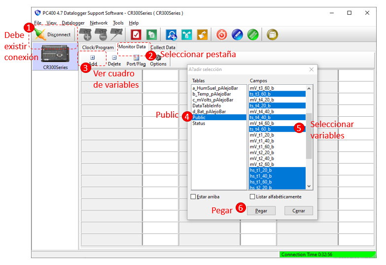
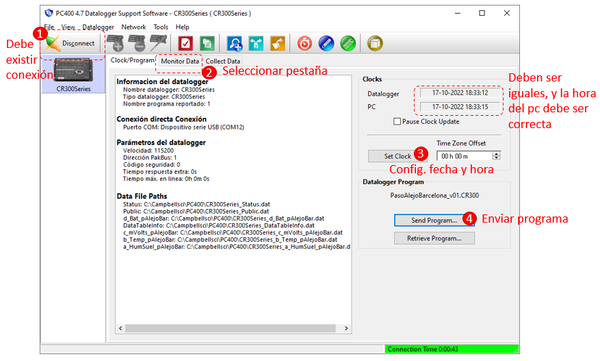

# Ensayos Humedades de Suelo.

### **Índice**
1. [Tabla de distribución de sensores.](#id1)
2. [Pasos para instalar una estación.](#id2)
3. [Configuración de direcciones SDI12 para Teros11.](#id3)
4. [Alimentación y cableado.](#id4)
5. [Descarga de datos.](#id5)
6. [Verificar valores instantáneos de variables.](#id6)
7. [Configuración de fecha y hora del datalogger y envío del programama.](#id7)
8. [Estaciones con modem.](#id8)

<div id='id1' />

## 1. Tabla de distribución de sensores.

A continuación, se despliegan los cuadros con la información de los sensores instalados.

**Tabla 1.** Estación Paso Alejo, Coihueco, en avellano europeo, variedad *Barcelona*. 
|**Tratamiento**|**Profundidad (cm)**|**N° serie sensor**|**Modelo sensor**|**N° de serie**|**Largo cable (m)**|**Canal CR300**|**Variables Public**|
|--|--|--|--|--|--|--|--|
|T1|20|1|T10|47976|20|SE1 ???|*hs_t1_20_b*|
|T1|40|2|T10|47977|20|SE2 ???|*hs_t1_40_b*|
|T1|60|3|T10|45893|20|SE3 ???|*hs_t1_60_b*|
|T2|20|1|T10|48400|10|SE4|*hs_t2_20_b*|
|T2|40|2|T10|47979|10|SE5|*hs_t2_40_b*|
|T2|60|3|T10|49020|10|SE6|*hs_t2_60_b*|
|T3|20|1|T11|14624|40|C1-0|*hs_t3_20_b* y *ts_t3_20_b*|
|T3|40|2|T11|14622|40|C1-1|*hs_t3_40_b* y *ts_t3_40_b*|
|T3|60|3|T11|14627|40|C1-2|*hs_t3_60_b* y *ts_t3_60_b*|
|T4|20|1|T11|20596|10|C2-0|*hs_t4_20_b* y *ts_t4_20_b*|
|T4|40|2|T11|20530|10|C2-1|*hs_t4_40_b* y *ts_t4_40_b*|
|T4|60|3|T11|20533|10|C2-2|*hs_t4_60_b* y *ts_t4_60_b*|

#

**Tabla 2.** Estación Paso Alejo, Coihueco, en avellano europeo, variedad *Lewis*. 
|**Tratamiento**|**Profundidad (cm)**|**N° serie sensor**|**Modelo sensor**|**N° de serie**|**Largo cable (m)**|**Canal CR300**|**Variables Public**|
|--|--|--|--|--|--|--|--|
|T1|20|1|T10|33482|20|SE1|*hs_t1_20_L*|
|T1|40|2|T10|46622|20|SE2|*hs_t1_40_L*|
|T1|60|3|T10|46625|20|SE3|*hs_t1_60_L*|
|T2|20|1|T11|20532|10|C1-0|*hs_t2_20_L* y *ts_t2_20_L*|
|T2|40|2|T11|20316|10|C1-1|*hs_t2_40_L* y *ts_t2_40_L*|
|T2|60|3|T11|20311|10|C1-2|*hs_t2_60_L* y *ts_t2_60_L*|
|T3|20|1|T10|46626|20|SE4|*hs_t3_20_L*|
|T3|40|2|T10|46623|20|SE5|*hs_t3_40_L*|
|T3|60|3|T10|46627|20|SE6|*hs_t3_60_L*|
|T4|20|1|T11|20314|10|C2-0|*hs_t4_20_L* y *ts_t4_20_L*|
|T4|40|2|T11|20310|10|C2-1|*hs_t4_40_L* y *ts_t4_40_L*|
|T4|60|3|T11|20312|10|C2-2|*hs_t4_60_L* y *ts_t4_60_L*|

#

**Tabla 3.** Estación Trehualemu, San Ignacio, en avellano europeo, variedad *Tonda di Giffoni*. 
|**Tratamiento**|**Profundidad (cm)**|**N° serie sensor**|**Modelo sensor**|**N° de serie**|**Largo cable (m)**|**Canal CR300**|**Variables Public**|
|--|--|--|--|--|--|--|--|
|T1|20|1|T10|35626|20|SE1|*hs_t1_20_t*|
|T1|60|3|T10|35625|20|SE2|*hs_t1_60_t*|
|T2|20|1|T11|20534|10|C1-0|*hs_t2_20_t* y *ts_t2_20_t*|
|T2|60|3|T10|49019|10|SE3|*hs_t2_60_t*|
|T3|20|1|T10|35788|20|SE4|*hs_t3_20_t*|
|T3|60|3|T10|45895|20|SE5|*hs_t3_60_t*|
|T4|20|1|T11|20601|10|C2-0|*hs_t4_20_t* y *ts_t4_20_t*|
|T4|60|3|T10|49021|10|SE6|*hs_t4_60_t*t|

#

**Tabla 4.** Estación AgriChie, San Gragorio, en avellano europeo, variedad *Tonda di Giffoni*. 
|**Tratamiento**|**Profundidad (cm)**|**N° serie sensor**|**Modelo sensor**|**N° de serie**|**Largo cable (m)**|**Canal CR300**|**Variables Public**|
|--|--|--|--|--|--|--|--|
|T1|20|1|T10|45898|20|SE1|*hs_t1_20_ag*|
|T1|60|2|T10|45900|20|SE3|*hs_t1_60_ag*|
|T2|20|1|T11|20038|10|C1-0|*hs_t2_20_ag* y *ts_t2_20_ag*|
|T2|40|2|T11|20588|10|C1-1|*hs_t2_40_ag* y *ts_t2_40_ag*|
|T2|60|3|T11|20531|10|C1-2|*hs_t2_60_ag* y *ts_t2_60_ag*|
|T3|20|1|T10|45892|20|SE4|*hs_t3_20_ag*|
|T3|60|2|T10|46897|20|SE6|*hs_t3_60_ag*|
|T4|20|1|T11|20589|10|C2-0|*hs_t4_20_ag* y *ts_t4_20_ag*|
|T4|40|2|T11|20131|10|C2-1|*hs_t4_40_ag* y *ts_t4_40_ag*|
|T4|60|3|T11|20529|10|C2-2|*hs_t4_60_ag* y *ts_t4_60_ag*|

#

**Tabla 5.** Estación CE-Arroz, San Carlos, Ensayos de Arroz. 
|**Tratamiento**|**Profundidad (cm)**|**N° serie sensor**|**Modelo sensor**|**N° de serie**|**Largo cable (m)**|**Canal CR1000x**|**Variables Public**|
|--|--|--|--|--|--|--|--|
|T1|05cm - bajo planta|1|T11|---|20|C1-0|*hs_t1_05p_ce* y *ts_t1_05p_ce*|
|T1|15cm - bajo planta|2|T10|---|20|SE1|*hs_t1_15p_ce*|
|T1|20cm - bajo gotero|3|T10|---|20|SE2|*hs_t1_20g_ce*|
|T2|05cm - bajo planta|1|T11|---|10|C2-0|*hs_t2_05p_ce* y *ts_t2_05p_ce*|
|T2|15cm - bajo planta|2|T10|---|10|SE3|*hs_t2_15p_ce*|
|T2|05cm - bajo gotero|3|T10|---|10|SE4|*hs_t2_05g_ce*|
|T3|05cm - bajo planta|1|T11|---|10|C3-0|*hs_t3_05p_ce* y *ts_t3_05p_ce*|
|T3|15cm - bajo planta|2|T10|---|10|SE5|*hs_t3_15p_ce*|
|T3|20cm - bajo gotero|3|T10|---|10|SE6|*hs_t3_20g_ce*|
|T3|15cm - bajo gotero|4|T10|---|10|SE7|*hs_t3_15g_ce*|
|T4|05cm - bajo planta|1|T11|---|20|C4-0|*hs_t4_05p_ce* y *ts_t4_05p_ce*|
|T4|15cm - bajo planta|2|T10|---|20|SE8|*hs_t4_15p_ce*|
|T4|05cm - bajo gotero|3|T10|---|20|SE9|*hs_t4_05g_ce*|
|T4|05cm - bajo **NO** gotero|4|T10|---|20|SE10|*hs_t4_05ng_ce*|

<div id='id2' />

## 2. Pasos para instalar una estación.

Para instalar una estación se debe realizar los siguientes pasos.

1. **Instalación en terreno:** Realizar la instalación en terreno de los sensores, datalogger, baterías, panel solar, gabinete y estructura.
2. **Etiquetado de sensores:** Al momento de instalar los sensores, identificar en el extremo de los cables que se conectarán al datalogger el tratamiento, modelo del sensor y profundidad, además de cualquier observación que sea pertinente.
3. **Asignar dirección a Teros11:** Luego identificar los sensores Teros11 y configurar las direcciones de acuerdo al cuadro respectivo que se presenta en la sección1. Para configurar la dirección de los sensores Teros11 (o Teros12), seguir la guía que se presentan en la sección3.
4. **Cableado de sensores:** Cablear sensores de acuerdo al cuadro respectivo que se presenta en la sección1.
5. **Otros cableados:** Cablear batería, panel solar y conexión tierra
6. **Cargar programa:** Configurar el data con el programa respectivo, para esto ver la sección7.
7. **Revizar variables:** Verificar valores instantáneos de variables según la guía que se presenta en la sección6.
8. **Descargar datos:** Esperar al menos 30 minutos y descargar datos siguiendo los pasos descritos en la sección5.
9. **Fín:** Si todo esta bien, cerrar gabinete y agendar una visita en un par de días para asegurar que todo esta midiendo correctamente, en caso contrario solicitar apoyo.

<div id='id3' />

## 3. Configuración de direcciones SDI12 para Teros11.

En el caso de tener múltiples sensores Teros11 o Teros12, se pueden configurar sus direcciones SDI12 para disponer de un máximo de 10 sensores por salida digital. En donde las direcciones de cada sensor deben ser configuradas desde 0 a 9 sin repetir por canal. En el caso del data CR300 se disponen de 2 canales digitales SDI12, C1 y C2, en el caso del data CR1000 se disponen de 4 canales SDI12, C1, C3, C5 y C7.
Para configurar la dirección SDI12 del sensor, hay que asegurar que exista conexión entre el data y el computador, luego se puede utilizar la aplicación Terminar Emulator (Emulador de Terminal) que en el software PC400 se encuentra en menú ***Datalogger->Terminar Emulator***. Una vez abierta la ventana de la terminal, hacer cliks sobre el botón ***Abrir la terminal***. Si todo sale bien, la terminal responderá con el modelo de datalogger, ejem:  ***CR300>***, luego se puede seguir la siguiente secuencia de comandos y respuestas, entre la terminal y el data:


```
CR300> SDI12    //Consuta para configurar protocolos SDI12.
1: C1
2: C2
Select SDI12 Port: 2    //Se debe seleccionar un puerto.
Entering SDI12 Terminal. Press ESC to exit  //Ingrese comando SDI12
?!  //Se consulta por la dirección actual del puerto seleccionado
0   //La dirección actual es cero.
0A2!    //Se configura una nueva dirección con el comando: "<dir actual>A<nueva dir>!", "A" en mayúscula.
?!  //Se verifica la nueva dirección
2   //Cnfirmado cambio de derección SDI12 del sensor.

```


A continuación se muestran los comandos en el emulador de terminal del software PC400.



**Figura 1.** Emulador de terminal, PC400. 

<div id='id4' />

## 4. Alimentación y cableado.

* 1 Teros10 -> amperaje: ***12mA***, voltaje: ***3 a 15 Volts***
* 1 Teros11 -> amperaje: ***16mA***, voltaje: ***4 a 15 Volts***

Por otra parte tenemos que el Switch 12V del CR300 suministra en total 900mA.

A continuación se muestran el cableado para los sensores Teros10 y Teros11.



**Figura 2.** Cableado sensor Teros10. 



**Figura 3.** Cableado sensor Teros11.


<div id='id5' />

## 5. Descaraga de datos.

La descarga de datos se realiza con el programa PC400, para esto se debe acceder a la pestaña ***Collect Data***, seleccionar las tablas: a_HumSuel_pAlejoBar, b_Temp_pAlejoBar, c_mVolts_pAlejoBar y d_Bat_pAlejoBar. Luego presionar el botón ***Start Data Collection***.



**Figura 4.** Descarga de datos. 

En la columna *File name* de la Figura 4 sale la ubicación y nombre de cada archivo. Para ver los datos puede arrastrar el archivo al bloc de nota abierto, o a un libro de Microsoft Excel.

<div id='id6' />

## 6. Verificar valores instantáneos de variables.

La verificación de las variables en tiempo real se realiza con el programa PC400, para esto se debe acceder a la pestaña ***Monitor Data***, luego presionar el botón ***Add***, se abrirá una nueva ventana, en donde se debe seleccionar el tipo de variable ***Public***. En el lado derecho de la ventana seleccionar específicamente las variables que se requiere monitorear.
Es muy importante que el tipo de variable sea ***Public***, ya que estos valores se actualizan a cada 10 segundos. En la variable se identifica tanto el parámetro que miden, como el tratamiento, profundidad y variedad.




**Figura 5.** Verificar valores instantáneos. 

A continuación, se presenta un cuadro resumen con las variables de acuerdo a las siglas con que comienzan.

**Tabla 3.** Cuadro para verificar valores instantáneos de variables. 
|**Siglas**|**Parametro**|
|--|--|
|hs_|Humedad de suelo (una por sensor teros10 y teros11)|
|ts_|Temperatura de suelo (una por sensor teros 11)|
|mV_|Voltaje de salida (una por sensor teros10 y teros11, en este caso, se recomienda no agragarlas)|

Las variables ***BattV*** y ***PTemp_C*** miden voltaje de batería y Temperatura interna del datalogger respectivamente.

<div id='id7' />

## 7. Configuración de fecha y hora del datalogger y envío del programama.

Para configurar la hora del data, primero se debe asegurar que existe conexión entre el data y el pc. La hora y fecha del pc deben estar correctamente configurada, si esto es asi, hacer clic en el botón ***Set Clock*** de la pestaña ***Clock/Program*** en el software PC400. Si la en el recuadro ***Clock*** la fecha-hora del datalogger y el pc son iguales, no es necesario hacer este paso.
Para enviar el programa, en la misma pestaña ***Clock/Program*** hacer clic sobre el botón ***Send Program*** y seleccionar el programa respectivo.

***IMPORTANTE!!!,… IMPORTANTE!!!***
***CUANDO SE ENVIA UN PROGRAMA NUEVO TODOS LOS DATOS ALMACENADOS SE BORRAN, POR LO QUE SI HAY DATOS ALMACENADOS, SE DEBEN DESCARGAR ANTES DE ENVIAR EL PROGRAMA. DE LO CONTRARIO SE PERDERAN PARA SIEMPRE.***




**Figura 6.** Configuración de fecha y hora del datalogger y envío del programama.


<div id='id7' />

8. [Estaciones con modem.](#id8)

* Estación Trehualemu.

* Estación AgriChie.

* Estación CE-Arroz.
